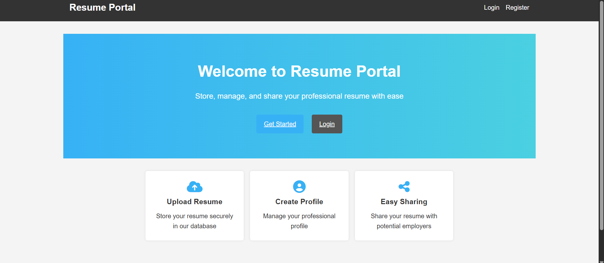
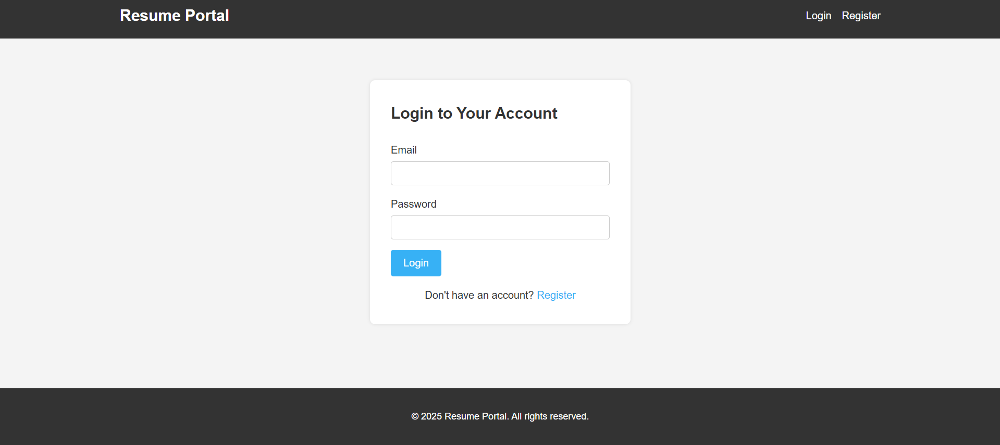
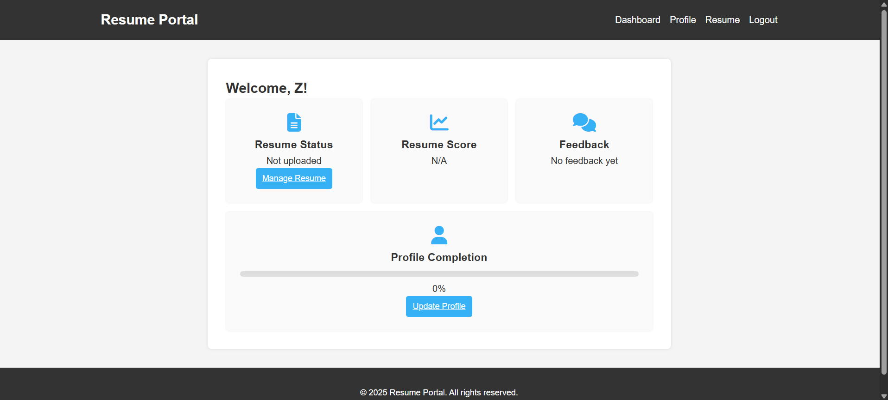
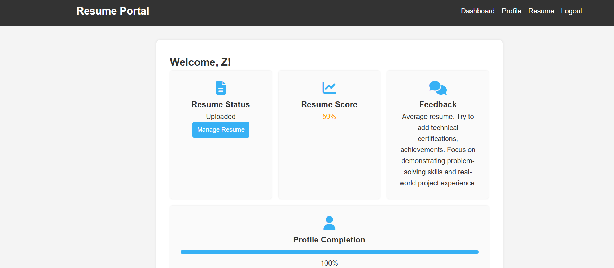

# AI-Powered Resume Scoring and Feedback

A small project that scores resumes and returns feedback using a machine-learning model. The repository contains a Node.js front-end/server and Python code for training and serving the ML model.

**Project Structure**
- `package.json` - Node project metadata and scripts (if present).
- `server.js` - Node server / backend entrypoint.
- `public/` - Front-end static files (`index.html`, `app.js`, `style.css`).
- `app.js`, `index.html`, `style.css` - client-side app and styles.
- `ml_model/` - Python code and data for training and serving the model.
  - `AI_Resume_Screening.csv` - training dataset (example input data).
  - `train_model.py` - script to train the model.
  - `resume_api.py` - lightweight API to serve the trained model.
  - `model/` - folder where trained model artifacts are stored.
- `uploads/` - folder used to hold uploaded resumes (used by the server/app).

**Features**
- Score resumes using an ML model (scikit-learn or similar).
- Provide basic feedback and a normalized score.
- Web UI (static) to upload resumes and view results.
- Python scripts to train or retrain the model.

**Requirements**
- Node.js (14+ recommended) and `npm`.
- Python 3.8+ for ML scripts and API.
- Python packages: `pandas`, `scikit-learn`, `fastapi`, `uvicorn`, `joblib`, `numpy`, `matplotlib` (see `ml_model/requirements.txt`).

Note: Always install from `ml_model/requirements.txt` to ensure all dependencies are properly pinned.

**Quick Start — Node (frontend/server)**
1. Install Node dependencies:

```powershell
cd "e:\projects\AI-Powered Resume Scoring and Feedback"
npm install
```

2. Create a `.env` file with your database credentials (copy from `.env.example`):

```powershell
Copy-Item .env.example .env
```

Then edit `.env` with your actual database credentials:
```
DB_HOST=localhost
DB_USER=root
DB_PASSWORD=your_password_here
DB_NAME=resume_portal
PORT=3000
ML_API_URL=http://localhost:8000/predict
```

3. Start the Node server:

```powershell
node server.js
```

4. Open the UI in your browser at `http://localhost:3000`

**Quick Start — Python (model API & training)**
1. Create and activate a virtual environment (PowerShell):

```powershell
cd "e:\projects\AI-Powered Resume Scoring and Feedback\ml_model"
python -m venv .venv
.\.venv\Scripts\Activate.ps1
```

2. Install Python packages:

```powershell
pip install -r requirements.txt
```

3. Run the model API using Uvicorn (serves predictions on port 8000):

```powershell
uvicorn resume_api:app --reload
```

The API will be available at `http://localhost:8000`. Visit `http://localhost:8000/docs` for interactive API documentation.

4. Train or retrain the model:

```powershell
python train_model.py
```

Training reads `AI_Resume_Screening.csv` and saves artifacts into `model/`.

5. (Optional) Run comprehensive model evaluation and testing:

```powershell
python test.py
```

This generates evaluation metrics (`model_metrics.json`), feature importances (`top_feature_importances.csv`), and residual plots (`model_residuals.png`).

**API / Integration**
The Node.js server on `localhost:3000` calls the Python FastAPI model server running on `localhost:8000`.

**FastAPI Model Server** (runs on port 8000):
- Root: `GET http://localhost:8000/` — health check
- Predict: `POST http://localhost:8000/predict` — score a resume

Example request to FastAPI:
```powershell
$body = @{
    skills = "Python, React, AWS"
    experience = 5
    education = "B.Tech"
    certifications = "AWS Certified"
    projects = 8
    salary = 80000
} | ConvertTo-Json

curl -X POST http://localhost:8000/predict `
  -H "Content-Type: application/json" `
  -d $body
```

Or visit `http://localhost:8000/docs` for interactive Swagger UI documentation.

**Configuration & Notes**
- The Node server (`server.js`) expects the FastAPI model server to be running at `http://localhost:5000/predict`.
- Ensure `uploads/` is writable by the server process.
- The ML model uses FastAPI + Uvicorn for async request handling and automatic API documentation.
- Model is trained using scikit-learn's RandomForestRegressor with a ColumnTransformer pipeline.

**Python Dependencies** (`ml_model/requirements.txt`)
All Python dependencies are pinned to specific versions:
- `numpy==1.26.4` — numerical computing
- `pandas==2.0.3` — data manipulation
- `scikit-learn==1.2.2` — ML algorithms
- `joblib==1.3.2` — model serialization
- `matplotlib==3.8.0` — visualization
- `fastapi==0.110.0` — API framework
- `uvicorn==0.29.0` — ASGI server

**Development Tips**
- Use virtual environments for Python work to avoid dependency conflicts.
- Add `.gitignore` entries for `ml_model/.venv/`, `uploads/`, and trained model artifacts in `ml_model/model/` if not intended for version control.
- If you change the ML model/data, retrain using `train_model.py` and verify via `resume_api.py`.

**File map (summary)**
- `server.js` — Node.js server (port 3000)
- `package.json` — Node.js dependencies & scripts
- `public/` — Front-end static assets (HTML, CSS, JS)
- `ml_model/` — Python ML module
  - `AI_Resume_Screening.csv` — training dataset
  - `train_model.py` — model training script
  - `resume_api.py` — FastAPI model server (port 8000)
  - `test.py` — comprehensive model evaluation & testing
  - `requirements.txt` — Python dependencies
  - `model/` — saved model artifacts
  - `model_metrics.json` — evaluation metrics (generated by test.py)
  - `model_residuals.png` — residual plot (generated by test.py)
  - `top_feature_importances.csv` — feature importances (generated by test.py)
- `uploads/` — uploaded resumes (server-generated)

**Screenshots & User Interface**

#### 1. Home Page (Before Login)

Welcome page with overview of Resume Portal features:
- Upload Resume — Store resumes securely in database
- Create Profile — Manage professional profile
- Easy Sharing — Share resume with potential employers

#### 2. Login Page

Simple login form for existing users:
- Email and password authentication
- Secure session management with bcrypt hashing
- Link to register for new users

#### 3. Dashboard (Before Resume Upload)

User dashboard showing:
- Resume Status: Not uploaded
- Resume Score: N/A
- Feedback: No feedback yet
- Profile Completion: 0%

#### 4. Dashboard (After Resume Upload)

After successfully uploading a resume:
- Resume Status: Uploaded
- Resume Score: 59% (example score)
- Feedback: AI-generated personalized feedback
- Profile Completion: 100%

#### 5. Resume Upload Section

Dedicated resume upload interface for submitting PDF/Word documents.

#### 6. Model Accuracy & Evaluation Results

Comprehensive model evaluation metrics:
- **MAE (Mean Absolute Error):** 2.44
- **MSE (Mean Squared Error):** 14.65
- **RMSE (Root Mean Squared Error):** 3.83
- **R² Score:** 0.971 (97.1% accuracy on test set)
- **Train R²:** 0.995 (99.5% accuracy on training set)
- **Cross-Validation RMSE:** 3.66 (±0.39)
- **Top Features:** Experience (Years) → 0.720, Projects Count → 0.237, Certifications → 0.010

The model demonstrates excellent predictive performance with minimal overfitting.

**Contributing**
- Fork and create a branch for your feature or fix.
- Add/adjust tests if applicable and update `README.md` with any new setup steps.
- Open a pull request with a clear description of changes.

**License**
This repository does not include a license file. If you want to make it open-source, consider adding an `MIT` license or another license that fits your needs.

